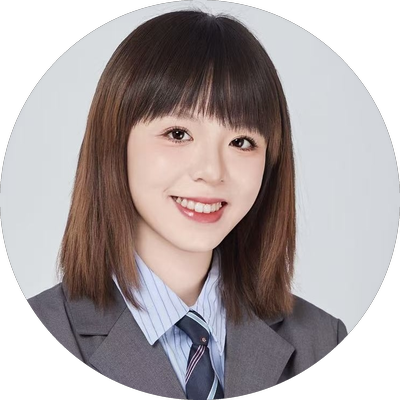

# Hi, I'm Xinyang Ma 👋

**Data Analyst · Business Intelligence · Power BI, SQL & Python**

I turn messy business data into dashboards and reports that people actually use.

---

### 🙋‍♀️ About me

- 📊 **Data Analyst** with hands-on BI experience at **Capgemini**: I built the sales reporting used by ~100 stakeholders in Sales, Finance and Marketing
- 🎓 **MSc Data Science & AI + Master in Management** (TBS Education), with a background in **Finance and International Economics**
- 🌍 Lived and worked in **China, Taiwan, France and Germany**. I work daily in Chinese, English and French, and I'm learning German (B1)
- 🎯 **Open to Data Analyst / BI Analyst roles** in the Munich area or remote in Germany

---

### 📈 Impact at a glance

<table>
  <tr>
    <td align="center" width="25%"><h2>40%</h2>less reporting prep time through automation</td>
    <td align="center" width="25%"><h2>~100</h2>business users on my Power BI dashboards</td>
    <td align="center" width="25%"><h2>68k+</h2>client meeting records turned into rolling KPIs</td>
    <td align="center" width="25%"><h2>8.7%</h2>MAPE, which won the Best Model Award (1st of 9 teams)</td>
  </tr>
</table>

---

### 💼 Experience

**Sales Operations Analyst (Intern) · Capgemini, Paris** · *Apr 2025 – Oct 2025*

- Built and maintained **5 Power BI dashboards** covering pipeline, forecast, revenue gaps, quota attainment and deals, with **row-level security, drill-through and waterfall analysis**
- Automated data ingestion, cleaning and KPI calculation with **Power Query and DAX**, which cut reporting prep time by **40%**
- Wrote a **1,200+ line Python (pandas) pipeline** that consolidates sales submissions from many Excel workbooks into one central database, with robust sheet detection and error handling
- Combined **Salesforce, SharePoint, data warehouse and Excel** data into semantic models with **one consistent definition per KPI**
- Built a **Python budget-allocation model** that recalculated the 2025 account budgets (MEUR) per salesperson and zone

---

### 🚀 Selected data projects

| Project | What I did | Result | Stack |
|---|---|---|---|
| 🏆 **Sales Forecasting Datathon** Pierre Fabre × TBS Education | Forecast monthly acne-product sales across **16 countries** | **Best Model Award**: lowest error (8.7% MAPE) of 9 teams | `Python` `SARIMA` `XGBoost` |
| ⚙️ **Production Time Prediction** APEM × TBS Education | Predicted operation times for complex manufacturing sequences | Supported production planning | `Python` `LSTM` |
| 🤖 **GenAI Skincare Chatbot** Pierre Fabre × TBS Education | Built an advisory chatbot with multi-intent NLP and product recommendations | Working conversational prototype | `Copilot Studio` `Python` `NLP` |

---

### 🛠️ Tech stack

**BI & Reporting** 

**Data & Programming** 

**Platforms & AI** 

---

### 📜 Certifications

| | Certification |
|---|---|
| ✅ | **Microsoft Certified: Power BI Data Analyst Associate** (PL-300) |
| ✅ | **Microsoft Certified: Azure Data Scientist Associate** (DP-100) |
| ✅ | **Tableau Desktop Specialist** |
| ✅ | **SAS Certified Data Scientist** |

---

### 🎓 Education

- **TBS Education**, Toulouse: Master in Management + MSc Data Science & AI *(dual degree, 2023 – 2025)*
- **University of Bordeaux**: Master in International Economics, with a focus on credit risk and quantitative analysis *(2021 – 2023)*
- **Jilin University**: Bachelor of Finance, including an exchange year at National Central University, Taiwan *(2016 – 2020)*

---

### 🗣️ Languages

🇨🇳 Chinese (native) · 🇬🇧 English (business fluent) · 🇫🇷 French (business fluent) · 🇩🇪 German (B1, still learning)

---

💬 **Let's talk data!** Reach me at [xinyangma18@gmail.com](mailto:xinyangma18@gmail.com).

